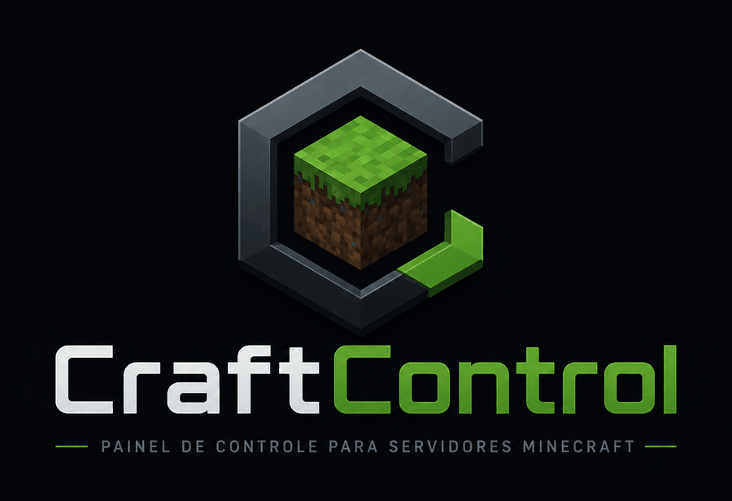

<p align="center">
  
</p>


Painel web para administrar um servidor Minecraft **Fabric, Forge, NeoForge,
Paper, Purpur, Spigot ou Folia** — jogadores, console, chat, backup, mods (ou
plugins) e energia — sem abrir SSH.

Feito para servidor caseiro rodando em Docker. Um contêiner, sem banco de dados,
sem build de frontend.

---

## O que ele faz

**Visão geral** — quem está online, TPS e ms/tick, CPU/RAM/disco do host, uptime,
console ao vivo e comandos rápidos, tudo numa tela.

**Jogadores** — quem está agora, por quanto tempo, e o histórico de quem já passou
pelo servidor (reconstruído do log, sobrevive a reinício do painel).

**Chat e console** — leitura ao vivo do `latest.log`, com o chat separado do resto.
Dá para falar no chat e mandar comando pelo painel.

**Moderação** — banir, expulsar, perdoar e gerenciar a whitelist.

**Mods e plugins** — a parte mais completa. O painel descobre sozinho com qual
servidor está falando: em Fabric, Forge e NeoForge ele cuida da pasta `mods/`; em
Paper, Purpur, Spigot e Folia, da pasta `plugins/`. A aba muda de nome junto, e o
resto funciona igual:

- lista o que está instalado com o **nome e a versão de verdade**, lidos de dentro
  do `.jar` (não do nome do arquivo);
- avisa quais têm **versão mais nova compatível** e atualiza com um clique;
- **instala do Modrinth** pela busca, já filtrada pelo seu carregador e versão;
- aceita **upload de `.jar`**, e **recusa o que não serve** explicando o porquê
  ("é um mod de Forge e este servidor é Fabric", "foi publicado para 1.20.1",
  "não declara suporte a Folia");
- entende que **plugin de Bukkit roda em Spigot, Paper e Purpur** — a herança da
  família, que decide o que o catálogo pode oferecer;
- **ativa e desativa** sem apagar nada;
- avisa quem quebra antes de você desativar algo ("29 mods dependem deste");
- e a rede de segurança: ao aplicar, o painel reinicia, **vigia o boot** e, se o
  servidor não voltar, **desfaz tudo sozinho** e reinicia de novo.

**Servidor** — ligar/parar/reiniciar, backup do mundo por download, restauração
com o mundo anterior preservado, e reinício agendado.

---

## Instalação

Você precisa de um servidor Minecraft **já rodando em Docker**, com RCON ligado.
O painel se anexa a ele.

```bash
git clone https://github.com/carlosj188/craftcontrol.git
cd craftcontrol
./instalar.sh
```

O `instalar.sh` pergunta o que falta, gera os segredos, confere os enganos comuns
(pasta errada, dono errado, contêiner que não existe) e sobe. Rodar de novo é
seguro — ele só pergunta o que ainda não está preenchido.

Depois abra `http://IP-DO-SERVIDOR:8095`.

### Ou na mão, se preferir

```bash
cp .env.example .env
$EDITOR .env          # preencha RCON_PASSWORD, ADMIN_PASSWORD e JWT_SECRET
docker compose up -d
```

### Se o seu servidor está em outro compose

O painel precisa **enxergar o contêiner do Minecraft pela rede do Docker**. O mais
simples é colar os dois serviços do `compose.yaml` dentro do compose que já sobe o
seu servidor. Aí `MC_HOST` é o nome do serviço dele (`mc`, no exemplo) e
`MC_CONTAINER` o nome do contêiner (`minecraft`).

### Requisitos

| | |
| --- | --- |
| Servidor | Fabric, Forge, NeoForge, Paper, Purpur, Spigot ou Folia em Docker, com RCON ligado |
| Dados | a pasta com `world/`, `mods/` (ou `plugins/`) e `logs/`, montada com **escrita** |
| Dono da pasta | uid **1000** — é como o painel escreve sem root (`chown -R 1000:1000`) |
| Energia | opcional; usa um socket-proxy com allowlist, nunca o socket do Docker direto |

Testado com a imagem [itzg/minecraft-server](https://github.com/itzg/docker-minecraft-server),
que é a mais comum. Deve funcionar com qualquer uma que respeite o layout padrão.

---

## Configuração

Tudo pelo `.env`. Os que importam:

| variável | o que é |
| --- | --- |
| `RCON_PASSWORD` | a mesma senha do `server.properties`. Precisa ser **fixa** |
| `ADMIN_USER` / `ADMIN_PASSWORD` | login do painel |
| `JWT_SECRET` | assina as sessões; o instalador gera |
| `MC_DATA` | pasta de dados do servidor, no host |
| `MC_CONTAINER` | nome do contêiner do Minecraft |
| `MC_HOST` | nome do serviço dele na rede do Docker |
| `PANEL_PORT` | porta do painel (padrão 8095) |
| `MODS_ONLINE=false` | desliga a consulta ao Modrinth |

### Mais de um servidor

O painel gerencia vários. Edite o `MC_SERVERS` no `compose.yaml` acrescentando
outro objeto, monte o volume de dados dele e **inclua o nome do novo contêiner no
regex do socket-proxy** — senão o controle de energia dele volta 403.

A senha vai pelo **nome da variável** (`"senhaEnv":"RCON_PASSWORD_CRIATIVO"`),
nunca o valor: o segredo continua só no `.env`.

---

## Segurança

- Login único com token JWT assinado (HS256), com trava contra força bruta.
- O contêiner roda **sem root** (uid 1000), com filesystem **read-only**,
  `cap_drop: ALL` e `no-new-privileges`.
- O painel **nunca toca no socket do Docker**. Ligar/desligar passa por um
  socket-proxy que só deixa passar `GET /containers/<seu-mc>/json` e
  `POST .../{start,stop,restart}` — nada de criar contêiner ou montar host.
- Upload de `.jar` é recebido num temporário e conferido **antes** de chegar na
  pasta que o servidor lê. Nome de arquivo passa por validação contra traversal.
- Ações destrutivas exigem digitar uma palavra de confirmação.

**Não exponha o painel na internet sem colocar HTTPS na frente** (Nginx Proxy
Manager, Caddy, Traefik). Ele foi feito para rede local ou atrás de VPN.

---

## Sobre o uso de IA

Este projeto foi escrito em par com **Claude** (Anthropic). Não é código gerado e
despejado num repositório: cada rodada foi especificada, revisada, testada e
colocada em produção por mim, num servidor real com jogadores em cima.

Sendo direto sobre o que isso significa:

- **A arquitetura e as decisões são minhas.** O que entra, o que fica de fora, o
  que é seguro o bastante para rodar em produção — isso foi decidido a cada passo,
  não delegado.
- **O código foi testado de verdade**, não só lido. Boa parte das armadilhas do
  projeto só apareceu rodando contra os 57 mods do meu servidor — jar
  multi-carregador, TOML com array inline, corrida no reinício rápido. Os testes
  ficaram no processo, não no repositório (ainda).
- **Os comentários no código são densos de propósito.** Eles explicam *por que* as
  coisas são como são, não o que a linha faz. Foi assim que o projeto não virou
  uma caixa-preta para mim mesmo.
- **Pode ter bug que ninguém viu.** Está em produção no meu servidor desde que foi
  escrito, mas isso é uma amostra de um, e o projeto é novo. Se achar algo, abra
  uma issue.

Se você usa IA para programar, o que funcionou aqui foi: escopo pequeno por
rodada, teste contra dados reais antes de acreditar, e nunca aceitar código que eu
não conseguisse explicar depois.

---

## Desenvolvimento

O frontend é **um único `index.html`** com CSS e JS inline — sem build, sem
bundler. Editar e reiniciar o contêiner basta.

```
src/backend/src/
  server.js     rotas HTTP (Fastify) e autenticação
  servers.js    monta um conjunto de módulos por servidor configurado
  rcon.js       protocolo RCON, com fila serializada
  mcdata.js     lê o volume: properties, bans, whitelist, tail do log
  history.js    histórico de jogadores, reconstruído do log
  mods.js       listar/ativar/desativar/remover/instalar/atualizar mods
  modmeta.js    lê metadados de dentro do .jar (fabric.mod.json, mods.toml)
  jar.js        leitor de zip sem dependência nenhuma
  compat.js     este mod serve neste servidor?
  aplicar.js    reinicia, vigia o boot e reverte se não subir
  backup.js     backup do mundo por streaming
  restore.js    restauração com o mundo anterior preservado
  agenda.js     reinício agendado
  docker.js     energia, via socket-proxy
  tps.js        TPS e ms/tick com comandos vanilla, sem mod
  sysinfo.js    CPU/memória/disco do host
src/web/index.html   o painel inteiro
```

**Zero dependências além de `fastify` e `@fastify/static`.** Leitura de zip, parser
de TOML e cliente do Modrinth são código do projeto — foi decisão consciente para
a imagem ficar pequena e a superfície de supply chain, mínima.

Para desenvolver contra um servidor remoto, o `deploy.sh` envia o código e
reconstrói o contêiner:

```bash
HOST=root@10.0.0.5 DEST=/opt/mc/painel ./deploy.sh
```

---

## Licença

MIT. Veja [LICENSE](LICENSE).

Minecraft é marca da Mojang/Microsoft. Este projeto não tem relação com eles.
Os metadados de mods vêm da [API do Modrinth](https://docs.modrinth.com/api/).
